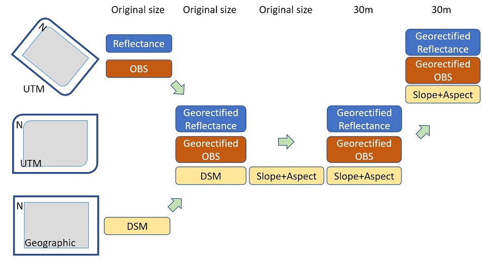

## Prerequisite

### Python Environment

Other than the basic Numpy, Scipy, the following packages are needed. 
- Google Python API:  Google Earth Engine + Google Drive (for geo-rectification)
- Arosics (for geo-rectification)
- GDAL (all steps)
- Pandas

For installing both Google APIs and Arosics, please read [gee_gdrive_arosics.md](./gee_gdrive_arosics.md)


### Data and File Organization

Refl and Obs files are stored in the same folder.

**An output folder:** Some temporarily files and final products will be put here.

**A folder for Copernicus DSM tiles:** DSM tiles downloaded from AWS will be kept here and will not be deleted so that they can be reused.
Download [tileList.txt](https://copernicus-dem-30m.s3.amazonaws.com/tileList.txt) to the local DSM folder.

## Script Workflow

The shell script convert the original AVIRIS reflectance and ancillary image to 30m images and keep their old rotation.
 


Run the script **workflow30m.sh**

Usage 
```bash
bash ~/workflow30m.sh f140613t01p00r14_rfl_v1b_img f140613t01p00r14rdn_b_obs_ort ~/data/ ~/data/output/ ~/aws_dsm/ rflgeorot obsgeorot
```

1 Geo-rectification

```bash
# Generate a single-band image for geo-rectification. Band 29 is used.
gdal_translate -b 29 "$dir"/"$img" "$outdir"/"$img"_b29.tif
# (output GeoTIFF: $outdir/"$img"_b29.tif)


# Generate spatial reference image online at GEE and download to local folder
python "$pycode_dir"/test_gee2.py --inputfiles "$outdir"/"$img"_b29.tif --outputdir $outdir
# If CD is not right, download file again: python "$pycode_dir"/gdrive_download_file.py "ref"_"$img"_b29.tif $outdir
# (output GeoTIFF: "$outdir"/ref_"$img"_b29.tif)


# Use Arosics to generate GCPs.
python "$pycode_dir"/arosics_test.py -r "$outdir"/ref_"$img"_b29.tif -t "$outdir"/"$img"_b29.tif -o $outdir --GCP_Only
# (output JSON: $outdir/"$img"_b29_GCPs.json)
```

2 Upscaling and rotating images

```bash

# Get metadata from Refl image. Bad band range is defined here.
python "$pycode_dir"/gen_corr_coeffs.py "$dir"/"$img" $outdir
# (output JSON: "$dir"/"$img"_corr_ceoffs.json)

# Upscale and rotate Refl image
python "$pycode_dir"/apply_geocorr_resize_rot_chunk2.py -t "$dir"/"$img" -o $outdir -g "$outdir"/"$img"_b29_GCPs.json -p 30 -r "$outdir"/"$img"_b29.tif --ext $rfl_pattern --corr "$outdir"/"$img"_corr_ceoffs.json
#(output ENVI: $outdir/"$img"_"$rfl_pattern")
#(output ENVI : $outdir/mask_"$img"_"$rfl_pattern")


# Upscale and rotate Obs image
python "$pycode_dir"/apply_geocorr_resize_rot_chunk_for_obs.py -t "$dir"/"$obs" -o $outdir  -g "$outdir"/"$img"_b29_GCPs.json -p 30 -r "$outdir"/"$img"_b29.tif --ext $obs_pattern --corr "$outdir"/"$img"_corr_ceoffs.json
#(output ENVI : $outdir/"$obs"_"$obs_pattern")

# Update header file for final Refl image
python "$pycode_dir"/copy_header_wavelist.py "$dir"/"$img".hdr "$outdir"/"$img"_"$rfl_pattern".hdr "$outdir"/"$img"_corr_ceoffs.json
#(Update ASCII: $outdir/"$img"_"$rfl_pattern".hdr)
```

3 Update OBS file with Copernicus 30m DSM
```bash
#prepare the "$aws_dir"/tileList.txt
#The list of tiles with data is saved in each bucket as tileList.txt.
#https://copernicus-dem-30m.s3.amazonaws.com/tileList.txt

#Step0:
python "$pycode_dir"/aws_down_topo.py --inputfiles "$outdir"/"$obs"_"$obs_pattern" --outputdir $aws_dir
#(output GeoTIFF: $aws_dir/topo_"$basenameobs"_tmp_terrain.tif)

# Step1:
python "$pycode_dir"/northup_2_rot_v5.py -img "$aws_dir"/topo_"$basenameobs"_tmp_terrain.tif   -ref "$outdir"/"$obs"_"$obs_pattern" -od $aws_dir -interp 2
#(output GeoTIFF: $aws_dir/topo_"$basenameobs"_tmp_terrain_rot.tif)

# Step2:
python "$pycode_dir"/merge_aws_obs_ort.py -img "$aws_dir"/topo_"$basenameobs"_tmp_terrain_rot.tif   -ref "$outdir"/"$obs"_"$obs_pattern"  -od $outdir
#(output ENVI: $outdir/"$obs"_"$obs_pattern"_corr)
```

4 Final products

  * ENVI: *$outdir/"$obs"_"$obs_pattern"_corr*
  * ENVI: *$outdir/"$img"_"$rfl_pattern"* 
  * ENVI: *$outdir/mask_"$img"_"$rfl_pattern"* 
  * JSON: *$outdir/"$img"_corr_ceoffs.json*
  * JSON: *$outdir/"$img"_b29_GCPs.json*

